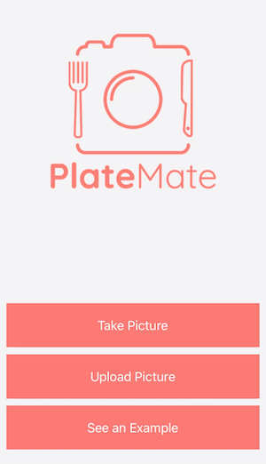

# PlateMate (HackLodge Bay Area W2020)

Hello! This is the repository for PlateMate, a project by @[alan-luo](https://github.com/alan-luo) and @[janniezhong](https://github.com/janniezhong), which was made during the Bay Area session of [Hack Lodge](https://hacklodge.org/) during winter 2020. Take a look at our [wiki](https://github.com/janniezhong/platemate/wiki) to find a video and more information!

